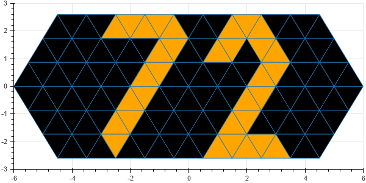
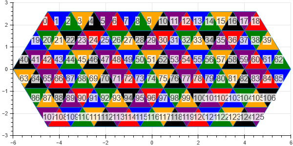
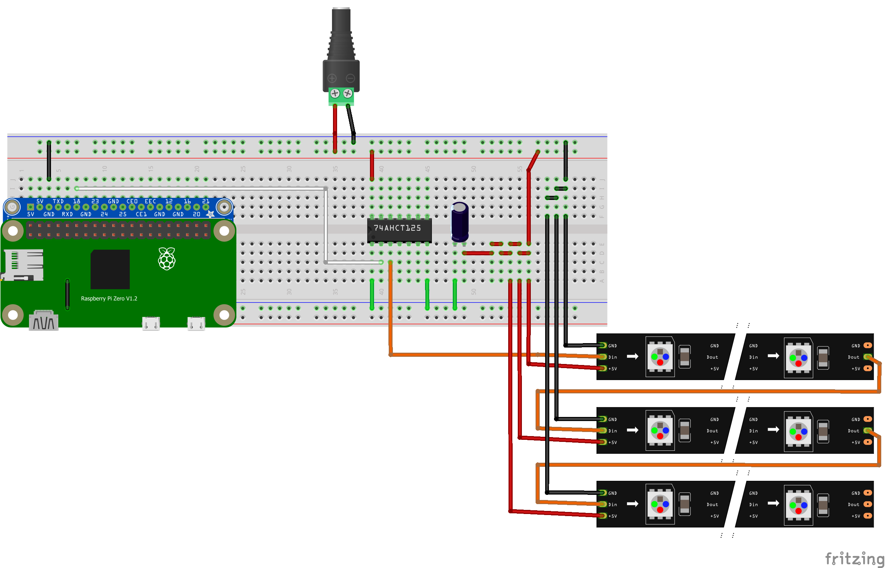

# Toblerone-Clock-Reborn
Mk 2 of the Toblerone Clock

Digits:



Clock mode (hours are green, minutes orange, seconds blue):


Pixel numbering scheme:



## Hardware

Wiring diagram (the pins tied together simulate how I created the nets on the protoboard).



## Installation

Standard system update and upgrade;
```
sudo apt update && sudo apt upgrade
```

For [`hostname.local` support](https://www.howtogeek.com/167190/how-and-why-to-assign-the-.local-domain-to-your-raspberry-pi/);
```
sudo apt-get install avahi-daemon
```

[Install Blinka from Adafruit](https://learn.adafruit.com/circuitpython-on-raspberrypi-linux?view=all);
```
sudo apt-get install python3-pip
sudo pip3 install --upgrade setuptools
cd ~
sudo pip3 install --upgrade adafruit-python-shell
wget https://raw.githubusercontent.com/adafruit/Raspberry-Pi-Installer-Scripts/master/raspi-blinka.py
sudo python3 raspi-blinka.py
```

[Install neopixel package](https://github.com/adafruit/Adafruit_CircuitPython_NeoPixel);
```
sudo pip3 install adafruit-circuitpython-neopixel
```

[Install docker and docker-compose](https://devdojo.com/bobbyiliev/how-to-install-docker-and-docker-compose-on-raspberry-pi);
```
curl -fsSL https://get.docker.com -o get-docker.sh
sudo sh get-docker.sh
sudo usermod -aG docker ${USER}
sudo su - ${USER}
docker version
docker run hello-world
sudo apt-get install libffi-dev libssl-dev
sudo pip3 install docker-compose
```

[Install requirements with poetry](https://python-poetry.org/docs/basic-usage/);
```
curl -fsSL https://raw.githubusercontent.com/python-poetry/poetry/master/get-poetry.py -o get-poetry.py
python3 get-poetry.py
poetry install
```

OR run with docker;
```
docker-compose up --build
```

## Interactive Designer

```
bokeh serve --show app.py
```
