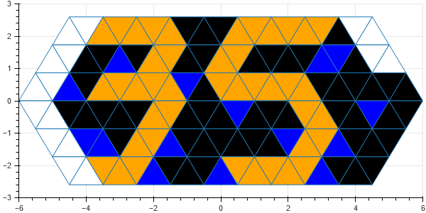

# Toblerone-Clock-Reborn
Mk 2 of the Toblerone Clock

Digits:


Clock mode (hours are green, minutes orange, seconds blue):



Pixel numbering scheme:


## Installation

```
pip install -r requirements.txt
```

## Interactive Designer

```
bokeh serve --show app.py
```
